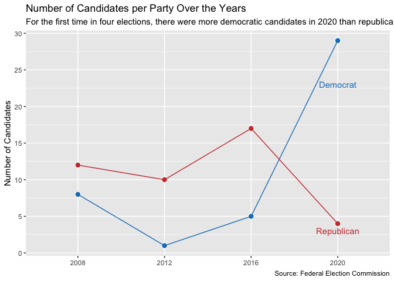
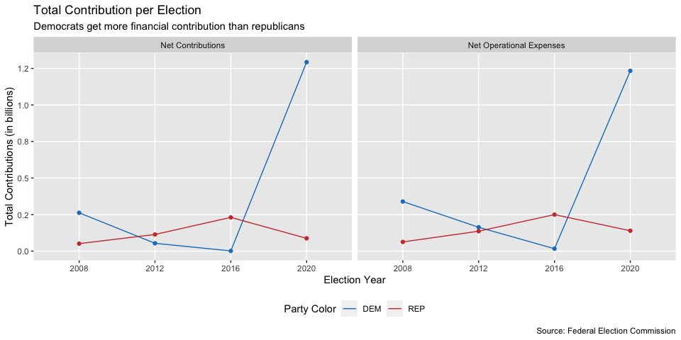
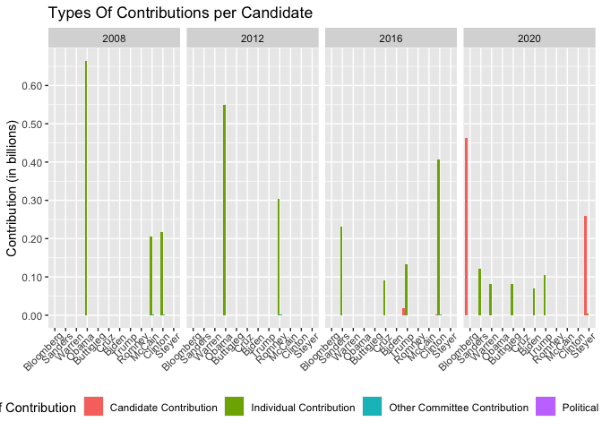
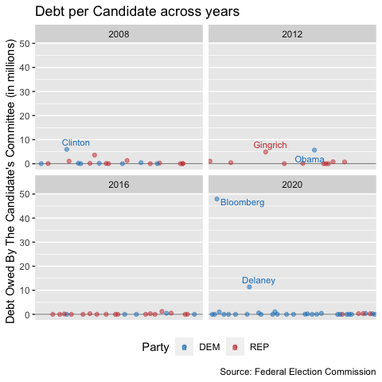

Presidential Candidates’ Financing Analysis
================
Tsion Tesfaye
2020-03-26

  - [Overview](#overview)
  - [Data Wrangling](#data-wrangling)
      - [Read in the data](#read-in-the-data)
      - [Exploratory Data Analysis
        (EDA)](#exploratory-data-analysis-eda)
          - [Number of Candidates per
            Party](#number-of-candidates-per-party)
          - [Spending per Party](#spending-per-party)
          - [Spending per Candidate](#spending-per-candidate)
          - [Breakdown of Contributions per
            Candidate](#breakdown-of-contributions-per-candidate)
          - [Debt per Candidate](#debt-per-candidate)

``` r
# Libraries
library(tidyverse)

# Parameters


  # Part II parameters
input_spending_2008 <- 
  "/Users/tsiontesfaye/Desktop/Classes/DCL/Portfolio/Datasets/2008_overall_summary.csv"
input_spending_2012 <- 
  "/Users/tsiontesfaye/Desktop/Classes/DCL/Portfolio/Datasets/2012_overall_summary.csv"
input_spending_2016 <- 
  "/Users/tsiontesfaye/Desktop/Classes/DCL/Portfolio/Datasets/2016_overall_summary.csv"
input_spending_2020 <- 
  "/Users/tsiontesfaye/Desktop/Classes/DCL/Portfolio/Datasets/2020_overall_summary.csv"

  # Official democrat and republican colors respectively
party_colors <- c("#1a80c4", "#cc3d3d") 

#===============================================================================
```

# Overview

The Federal Election Commission provides
[data](https://www.fec.gov/data/browse-data/?tab=candidates) on
presidential candidate spending for every election cycle. This data
summarizes financial information disclosed by presidential candidates
who have reported at least $100,000 in contributions from individuals
other than the candidate. Visit [the
website](https://www.fec.gov/data/browse-data/?tab=candidates) for more
details. We are interested in understanding the change in candidate
spending over the time. The 2020 files contain financial activity
through January 31, 2020 for presidential monthly filers and through
December 31, 2019 for presidential quarterly filers. Description of the
variables can be found
[here](https://www.fec.gov/campaign-finance-data/candidate-summary-file-description/).

# Data Wrangling

## Read in the data

``` r
# Create a vector of each separate csv file so that it can be fed into the pipe
all_csvs <- 
  c(
    input_spending_2008, 
    input_spending_2012, 
    input_spending_2016, 
    input_spending_2020
  )


# Since the majority of the candidates are either DEM or REP, we'll only analyze those.
all_spendings <- 
  all_csvs %>% 
  map(read_csv) %>% 
  #use reduce(rbind) to unite the different csvs into one since they have the same col name
  reduce(rbind) %>% 
  select_all(all_vars(str_to_lower(.))) %>%
  filter(
    str_detect(cand_pty_affiliation, "REP|DEM"),
    !str_detect(cand_nm, "Democrats,|Republicans,")
  ) %>% 
  mutate(
    election_yr = as.character(election_yr),
    cand_nm = str_replace(cand_nm, "(^.*)(,.*$)", "\\1")
  )
```

    ## Warning: Using quosures is deprecated
    ## Please use a one-sided formula, a function, or a function name
    ## This warning is displayed once per session.

## Exploratory Data Analysis (EDA)

### Number of Candidates per Party

Let’s take a closer look at the dataset at hand starting with general
analysis of the parties. First, let’s look at the number of candidates.

``` r
all_spendings %>% 
  count(cand_pty_affiliation, election_yr) %>% 
  ggplot(aes(election_yr, n, fill = cand_pty_affiliation)) +
  geom_point(shape = 21, size = 3, stroke = 0.7, color = "white") +
  geom_line(aes(group = cand_pty_affiliation, color = cand_pty_affiliation)) +
  scale_fill_manual(values = party_colors) +
  scale_color_manual(values = party_colors) +
  scale_y_continuous(breaks = scales::breaks_width(5)) +
  annotate(
    "text",
    x = c("2020", "2020"),
    y = c(23, 3),
    label = c("Democrat", "Republican"),
    color = party_colors
  ) +
  theme(legend.position = "") +
  labs(
    x = NULL,
    y = "Number of Candidates",
    title = "Number of Candidates per Party Over the Years",
    subtitle = 
      "For the first time in four elections, there were more democratic candidates in 2020 than republican.",
    caption = "Source: Federal Election Commission"
  )
```

<!-- -->

Each party had a total of 43 candidates over the four elections.
Usually, there are more republican candidates than democrats. However,
in 2020, there are more democratic candidates (`29`) than republicans
(`4`).

### Spending per Party

Now, let’s take a look at spending by party.

``` r
facet_labels <- 
  c(
    party_net_contributions = "Net Contributions", 
    party_net_operating_exp = "Net Operational Expenses"
  )


all_spendings %>% 
  group_by(election_yr, cand_pty_affiliation) %>% 
  summarize(
    party_net_contributions = sum(net_contributions),
    party_net_operating_exp = sum(net_operating_exp)
  ) %>% 
  ungroup() %>% 
  pivot_longer(
    cols = c(-election_yr, -cand_pty_affiliation),
    names_to = "type",
    values_to = "amount"
  ) %>% 
  ggplot(
    aes(
      election_yr, 
      amount, 
      color = cand_pty_affiliation, 
      group = cand_pty_affiliation
    )
  ) +
  geom_line() +
  geom_point(show.legend = FALSE) +
  scale_y_continuous(
    breaks = scales::breaks_width(0.25*1e9),
    labels = scales::label_number(accuracy = 0.1, scale = 1e-9),
    minor_breaks = FALSE
  ) +
  scale_color_manual(
    values = party_colors
  ) +
  facet_wrap(vars(type), labeller = labeller(type = facet_labels)) +
  theme(legend.position = "bottom") +
  labs(
    x = "Election Year",
    y = "Total Contributions (in billions)",
    title = "Total Contribution per Election",
    subtitle = "Democrats get more financial contribution than republicans",
    caption = "Source: Federal Election Commission",
    color = "Party Color"
  )
```

<!-- -->

In 2008 and 2020, democrats received more contributions and had more net
expenses while republicans had higher contributions in 2012 and 2016. In
the past three elections, both parties had net contributions and net
expenditures between 0.1 and 0.2 billion dollars. However, 2020 broke
the record. Democrats have five times as much and spent five times as
much. Even with taking inflation into account, this is a significant
increase.

Let’s find out the per candidate distribution of contribution and
spending.

### Spending per Candidate

``` r
# tibble for finding the median net spending per election year
medians <- 
  all_spendings %>% 
  group_by(election_yr) %>% 
  summarize(
    median_exp = median(net_operating_exp),
    median_cont = median(net_contributions)
  )

# tibble for labeling outliers
outliers <- 
  all_spendings %>% 
  filter(net_operating_exp >= 0.5 * 1e8)
  
  
all_spendings %>% 
  ggplot(aes(net_contributions, net_operating_exp, fill = cand_pty_affiliation)) +
  geom_point(show.legend = FALSE, alpha = 0.5, shape = 21, color = "white", size = 3) +
  geom_hline(
    data = medians,
    aes(yintercept = median_exp),
    color = "seagreen4",
    size = 0.2
  ) +
  ggrepel::geom_text_repel(
    data = outliers,
    aes(x = net_contributions, y = net_operating_exp, label = cand_nm),
    show.legend = FALSE
  ) +
  geom_text(
    inherit.aes = FALSE,
    data = medians,
    aes(Inf, median_exp),
    label = "Median Expenditure",
    hjust = 1,
    vjust = -0.1
  ) +
  scale_fill_manual(values = party_colors) +
  scale_y_continuous(
    labels = scales::label_number(scale = 1e-9, accuracy = 0.1),
    #expand = expand_scale(c(0, -9*1e-9))
    minor_breaks = FALSE
  ) +
  scale_x_continuous(
    labels = scales::label_number(scale = 1e-9, accuracy = 0.1),
    #expand = expand_scale(c(0, -9*1e-9))
    minor_breaks = FALSE
  ) +
  facet_wrap(vars(election_yr)) +
  labs(
    x = "Net Contributions (in billions)",
    y = "Net Operating Expenditure (in billions)",
    title = "Net Operating Expenditure per Candidate per Election Cycle",
    caption = "Source: Federal Election Commission"
  )
```


As one would expect, the higher the net operating expenditure, the
higher the net contributions implying a strong correlation. In `2008`,
and `2020`, most of the above median spenders have been democrates while
democrats dominated in `2012` and `2016`. Amongst the past four
elections, `2012` is the year with the fewest candidates spending above
the median. It is clear that `2020` breaks the record in terms of net
candidate expenditure and net contributions. Bloomberg stands out as the
all time highest spender at `0.4` billion dollars with a total of `0.5`
billion raised.

When we look at the individual candidates, we notice that Clinton had a
considerably higher expenditure in `2008` although she didn’t win the
primary nomination. In `2016`, none of the primary winners (Trump or
Clinton) stood out in terms of their spending or amounts raised. It is
peculiar that Trump wasn’t one of the outliers in the 2016 election
since the media coverage seems to have implied that he spent a
significant amount on advertising. In 2020, the democratic front runners
spent considerably higher than the median. It is particularly notworthy
that Bloomberg and Steyer, the candidates who have dropped out as of
March 6, 2020 were the top two spenders. Trump is also spending highly
in 2020.

Let’s take a closer look at the resting balance of candidates as of Jan
31st, 2020.

``` r
# tibble for labeling outliers
outliers_diff <- 
  all_spendings %>% 
  mutate(diff = (total_contributions - net_operating_exp)) %>% 
  filter(diff >= 12 * 1e6 | diff <= -12 * 1e6) %>% 
  arrange(desc(election_yr), diff) %>% 
  select(cand_nm, election_yr, diff, everything())
```

``` r
all_spendings %>% 
  mutate(
    diff = (total_contributions - net_operating_exp)
  ) %>%
  ggplot(aes(x = diff, y = cand_nm, color = cand_pty_affiliation)) +
  geom_segment(
    aes(x = 0, xend = diff, yend = cand_nm, y = cand_nm),
    show.legend = FALSE,
    size = 1
  ) +
  geom_point(
    aes(x = diff, y = cand_nm), size = 1, show.legend = FALSE, color = "white"
  ) +
  geom_vline(xintercept = 0, color = "green3", alpha = 0.4) +
  ggrepel::geom_text_repel(
    data = outliers_diff,
    aes(x = diff, label = cand_nm),
    show.legend = FALSE,
    direction = c("y"),
    size = 3.5
  ) +
  scale_color_manual(values = party_colors) +
  scale_x_continuous(
    labels = scales::label_number(scale = 1e-9, accuracy = 0.1),
    breaks = scales::breaks_width(.1e9),
    expand = expansion(add = c(6*1e6, 0)),
    minor_breaks = FALSE
  ) +
  scale_y_discrete(
    labels = NULL,
    breaks = NULL
  ) +
  facet_wrap(vars(election_yr)) +
  labs(
    x = "Net Cash (Contribution - Expenditure)\n(in billions)",
    y = NULL,
    title = "Net Cash per Candidate per Election Cycle",
    caption = "Source: Federal Election Commission"
  )
```


This plot shows that most candidates break even ending up with a net
cash of $0. However, the few outliers seem to have raised more than
their expenditure. Obama’s positive net cash in 2008 tops the charts
while Trump in 2020 is the only candidate to have lost about `32
million` USD as of Jan 31st, 2020.

### Breakdown of Contributions per Candidate

Let’s take a closer look at the candidates with the highest amount of
contributions.

``` r
cont_label <- 
  c(
    "Candidate Contribution", 
    "Individual Contribution", 
    "Other Committee Contribution", 
    "Political Party Contribution"
  )

all_spendings %>% 
  filter(total_contributions >= (mean(all_spendings$total_contributions) + 10000000)) %>%
  select(
    election_yr, cand_nm, cand_pty_affiliation, individual_contributions, 
    political_party_contrb, other_cmte_contrib, candidate_contrib
  ) %>% 
  pivot_longer(
    cols = -c(election_yr, cand_pty_affiliation, cand_nm),
    names_to = "cont_type",
    values_to = "amt"
  ) %>% 
  ggplot(aes(fct_reorder(cand_nm, amt), amt, fill = cont_type)) +
  geom_col(position = "dodge2") +
  scale_fill_discrete(labels = cont_label) +
  scale_y_continuous(
    labels = scales::label_number(scale = 1e-9),
    breaks = scales::breaks_width(0.1e9)
  ) +
  facet_grid(cols = vars(election_yr)) +
  theme(axis.text.x = element_text(angle = 45, hjust = 0.9)) +
  theme(legend.position = "bottom") +
  labs(
    fill = "Type of Contribution",
    x = NULL,
    y = "Contribution (in billions)",
    title = "Types Of Contributions per Candidate"
  )
```

<!-- -->

This plot demonstrates that most candidates run on Individual
Contributions with Other Committee Contributions and Political Party
Contributions being negligible. In 2016, Trump contributed 25 million
dollars of his own money. This was the highest individual contribution
at the moment. However,the 2020 candidates Bloomberg and Steyer broke
the record by contributing 0.45 and 0.25 billion dollars of their own
money respectively. Bloomberg did not raise any money in individual
contributions while Steyer has raised a small amount.

### Debt per Candidate

``` r
outliers_debt <- 
  all_spendings %>% 
  filter(debts_owed_by_cmte >= 4000000)
  
  
  
all_spendings %>% 
  ggplot(aes(cand_nm, debts_owed_by_cmte, color = cand_pty_affiliation)) +
  geom_hline(
    yintercept = median(all_spendings$debts_owed_by_cmte),
    size = 0.4,
    color = "black",
    alpha = 0.5
  ) +
  geom_point(alpha = 0.5) +
  ggrepel::geom_text_repel(
    data = outliers_debt,
    aes(label = cand_nm),
    size = 3
  ) +
  scale_color_manual(values = party_colors) +
  scale_x_discrete(breaks = FALSE) +
  scale_y_continuous(
    labels = scales::label_number(scale = 1e-6)
  ) +
  facet_wrap(vars(election_yr)) +
  theme(
    legend.position = "bottom",
    axis.text.x = element_text(angle = 45, hjust = 0.9)
  ) +
  labs(
    x = NULL,
    y = "Debt Owed By The Candidate's Committee (in millions)",
    color = "Party",
    title = "Debt per Candidate across years",
    caption = "Source: Federal Election Commission"
  )
```

<!-- -->

It is promising to see that almost all candidates have cleared their
debts. There seems to be a pattern that all republicans clear their
debts with a few exceptions while some democrats still owe money years
after their campaign.It is concerning that Clinton and Obama still owe
about 5 million dollars in debt. Gingrich is also high up on the list
owing 0.4 million dollars from his presidential bid in 2012. Bloomberg
owes 50 million which isn’t too significant given that he spent 0.4
billion of his own money for the race. Meanwhile, Delaney (who dropped
out of the race on Jan 31st, 2020) still owes 10 million dollars in
debt.
